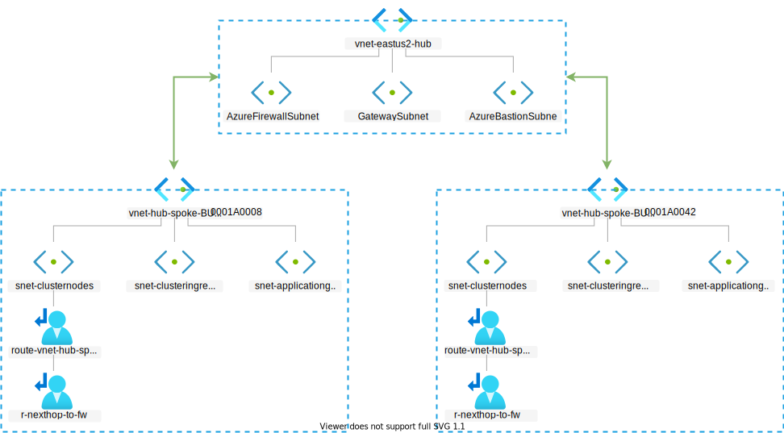

# Deploy the Hub-Spoke Network Topology

The prerequisites for the [AKS secure baseline cluster](./) are now completed with [Azure AD group and user work](./03-aad.md) performed in the prior steps. Now we will start with our first Azure resource deployment, the network resources.

## Steps

1. Login into the Azure subscription that you'll be deploying into.

   > :book: The networking team logins into the Azure subscription that will contain the regional hub. At Contoso Bicycle, all of their regional hubs are in the same, centrally-managed subscription.

   ```bash
   az login --tenant $TENANT_ID
   ```

1. Create the networking hubs resource group.

   > :book: The networking team has all their regional networking hubs in the following resource group. The group's default location does not matter, as it's not tied to the resource locations. (This resource group would have already existed.)

   ```bash
   # [This takes less than one minute to run.]
   az group create --name rg-enterprise-networking-hubs --location centralus
   ```

1. Create the networking spokes resource group.

   > :book: The networking team also keeps all of their spokes in a centrally-managed resource group. As with the hubs resource group, the location of this group does not matter and will not factor into where our network will live. (This resource group would have already existed.)

   ```bash
   # [This takes less than minute to run.]
   az group create --name rg-enterprise-networking-spokes --location centralus
   ```

1. Create the regional network hub.

   > :book: When the networking team created the regional hub for eastus2, it didn't have any spokes yet defined, yet the networking team always lays out a base hub following a standard pattern (defined in `hub-default.json`). A hub always contains an Azure Firewall (with some org-wide policies), Azure Bastion, a gateway subnet for VPN connectivity, and Azure Monitor for network observability. They follow Microsoft's recommended sizing for the subnets.
   >
   > The networking team has decided that `10.200.[0-9].0` will be where all regional hubs are homed on their organization's network space.
   >
   > Note: Azure Bastion and the On-Prem Connectivity is not actually deployed in this reference implementation, just the subnets for them are.
   >
   > In addition to the eastus2 regional hub (that you're deploying) you can assume there are similar deployed as well in in other Azure regions in this resource group.

   ```bash
   # [This takes about five minutes to run.]
   az deployment group create --resource-group rg-enterprise-networking-hubs --template-file networking/hub-default.json --parameters location=eastus2
   ```

   The hub creation will emit the following:

      * `hubVnetId` - which you'll will need to know for future spokes that get created. E.g. `/subscriptions/[subscription id]/resourceGroups/rg-enterprise-networking-hubs/providers/Microsoft.Network/virtualNetworks/vnet-eastus2-hub`

1. Obtain the Hub Virtual Network Resource Id that is going to be used to create the following spokes

   ```bash
   HUB_VNET_ID=$(az deployment group show -g rg-enterprise-networking-hubs -n hub-default --query properties.outputs.hubVnetId.value -o tsv)
   ```

1. Create the first spoke that will be home to the AKS cluster for the app team working on the A0008 and its adjacent resources.

   > :book:  The networking team receives a request from an app team in business unit (BU) 0001 for a network spoke to house their new AKS-based application (Internally know as Application ID: A0008). The network team talks with the app team to understand their requirements and aligns those needs with Microsoft's best practices for a secure AKS cluster deployment. They capture those specific requirements and deploy the spoke, aligning to those specs, and connecting it to the matching regional hub.

   ```bash
   # [This takes about ten minutes to run.]
   az deployment group create --resource-group rg-enterprise-networking-spokes --template-file networking/spoke-BU0001A0008.json --parameters location=eastus2 hubVnetResourceId="${HUB_VNET_ID}"
   ```

   The spoke creation will emit the following:

     * `appGwPublicIpAddress` - The Public IP address of the Azure Application Gateway (WAF) that will receive traffic for your workload.
     * `clusterVnetResourceId` - The resource ID of the VNet that the cluster will land in. E.g. `/subscriptions/[subscription id]/resourceGroups/rg-enterprise-networking-spokes/providers/Microsoft.Network/virtualNetworks/vnet-hub-spoke-BU0001A0008-00`
     * `nodepoolSubnetResourceIds` - An array containing the subnet resource IDs of the AKS node pools in the spoke. E.g. `["/subscriptions/[subscription id]/resourceGroups/rg-enterprise-networking-spokes/providers/Microsoft.Network/virtualNetworks/vnet-hub-spoke-BU0001A0008-00/subnets/snet-clusternodes"]`

1. Create the second spoke that will be home to the AKS cluster for the app team working on A0042 and its adjacent resources.

   > :book:  The networking team receives a second request from another app team under the same business unit (BU) 0001, this is for the creation of a second network spoke. In this opportunity, this is also for an AKS-based application (Internally known as Application ID: A0042). Same as before, the networking and app teams talk each other to understand the requirements and while capturing them, they will realize that it needs to be located in the exact same region as the first spoke.  Given that, the networking team will deploy the new spoke connecting it to the same regional hub A assigning new address prefixes to the new vnet and subnets, otherwise they will be conflicting at the time of peering them together.  This starts depicting the Contoso organization's multinancy model at the infrastructure level.

   ```bash
   # [This takes about ten minutes to run.]
   az deployment group create --resource-group rg-enterprise-networking-spokes --template-file networking/spoke-BU0001A0042.json --parameters location=eastus2 hubVnetResourceId="${HUB_VNET_ID}"
   ```

1. Update the shared, regional hub deployment to account for the requirements of the multiple spokes.

   > :book: Once their hub has one or more spokes, it can no longer run off of the generic hub template. The networking team creates a named hub template (e.g. `hub-eastus2.json`) to forever represent this specific hub and the features this specific hub needs in order to support its spokes' requirements. As new spokes are attached and new requirements arise for the regional hub, they will be added to this template file.

   ```bash
   # [This takes about three minutes to run.]
   NODEPOOL_SUBNET_RESOURCEIDS_SPOKE_BU0001A0008=$(az deployment group show -g rg-enterprise-networking-spokes -n spoke-BU0001A0008 --query properties.outputs.nodepoolSubnetResourceIds.value -o tsv)
   NODEPOOL_SUBNET_RESOURCEIDS_SPOKE_BU0001A0042=$(az deployment group show -g rg-enterprise-networking-spokes -n spoke-BU0001A0042 --query properties.outputs.nodepoolSubnetResourceIds.value -o tsv)
   az deployment group create --resource-group rg-enterprise-networking-hubs --template-file networking/hub-regionA.json --parameters location=eastus2 nodepoolSubnetResourceIds="['${NODEPOOL_SUBNET_RESOURCEIDS_SPOKE_BU0001A0008}','${NODEPOOL_SUBNET_RESOURCEIDS_SPOKE_BU0001A0042}']"
   ```

   > :book: At this point the networking team has delivered two spokes in which the BU 0001's app teams can lay down their AKS clusters (IDs: A0008, and A0042). The networking team provides the necessary information to the app teams for them to reference in their Infrastructure-as-Code artifacts.
   >
   > Hubs and spokes are controlled by the networking team's GitHub Actions workflows. This automation is not included in this reference implementation as this body of work is focused on the AKS baseline and not the networking team's CI/CD practices.

   The network topology diagram after the hub specialization is complete:

   

### Next step

:arrow_forward: [Deploy the AKS cluster](./05-aks-cluster.md)
