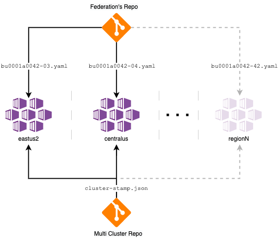

# Azure Kubernetes Service (AKS) Multi Cluster

This reference implementation will go over some design decisions from the baseline to detail them as a well as incorporate some new _recommended infrastructure options_ for a Multi Cluster architecture. In this oportunity, this implementation and document are meant to guide the multiple distinct teams introduced in the [AKS Baseline](https://github.com/mspnp/aks-secure-baseline) through the process of expanding from a single cluster to multiple clusters solution with a foundamental driver in mind which is **High Availability**.

Throughout the reference implementation, you will see reference to _Contoso Bicycle_. They are a fictional small and fast-growing startup that provides online web services to its clientele on the east coast US-based. This narrative provides grounding for some implementation details, naming conventions, etc. You should adapt as you see fit.

### Intro

The app team works on a cluster strategically located in the `East US 2` region as this is where most of their customer base can be found. They have been operating this solo AKS cluster for a quite some time [following the recommended baseline practices to work with a single AKS cluster, and they learned them all by heart](https://github.com/mspnp/aks-secure-baseline).

Thanks to baseline the cluster is already available from different _Zones_ within the same region, now they realize that provided `East US 2` went fully down, they are out of game. Even though the SLA(s) are acceptable for their business continuity plan, they are starting to think what are the options, and how their stateless application (Application ID: a0042) could increase its availability in case of an incident of the magnitude mentioned above. They started conversations with the business unit (BU0001) to increment the number of clusters by one. In other words, they are proposing to go over a Multi Cluster infrastructure solution in which multiple intances of the same application could live.

This architectural decision will have multiple implications for the Contoso Bicycle organization. It is not just about repeating everything they have done before but planning how efficiently share Azure resources as well as detect those that need to be added, how they are going to deploy more than one cluster as well as operate them, decide to which specific regions they deploy, and many more considerations striving for High Availability.

### Federation

The business unit (BU0001) approves the creation of a second cluster that could help balacing the traffic but mainly to serve as a hot backup, they are a bit worried on the required engineering effort though. The same application (Application Id: a0042) is about to span into multiple clusters, so there is a desire to find out a good mechanism for its configuration management. With that in mind, the app team is looking at what _Federation_ approaches they could follow to run different intances of the exact same app in different clusters.

They know that at this point things must be kept simply, in fact they could run these two application instances (Applications Ids: `a0042-03` and `a0042-04`) from the two  regional clusters with just a bunch of useful scripts. But they want to be sure that the selected approach is not going to be adding impediments that could prevent from scaling out their fleet of clusters down to road if there was a requirment to scale up the amount application instances.

Depending on how federation is implemetned it could open a door in which a single command execution has an instant ripple effect into all your clusters. While running clusters separately like silos could keep you safe from it, the cost could be really hight by struggling at scaling the number of clusters in the future.

They know that there is specialized tooling out there that helps managing a centralized control plane to push the workload(s) behavior top to bottom reacting to special events like _region down_ but they want to proceed with caution in this area for now.

Given that this Reference Implementation provides with a middle ground solution in which an organization could build the basis for the future without this being a weight on their shoulders for just two clusters. Therefore, the recommendation is to manage the workload manifests sperately per instance from a central _Federation_ git repository in combination with a CI/CD pipeline. The latter is not implemenated as part of this reference implementation.

### Multi cluster management in multiple regions

The new selected location is `Central US` that happens to be the Azure paired region for `East US 2`. Now the networking team in conjunction with the app team are closely working together to understand what is the best way for laying down the new fleet of clusters.

All in all, the team resolution is to have CI/CD pipelines, traffic management and centralized gitops as well as centralize the git repos containing the workloads manifest, and a single declarative stamp for the cluster creation with different param files per region.

> :bulb: Multi Cluster and Federation's repos could be a monorepo or multiple repos as displayed from the digram above. In this reference implementation, the workload manifests, and ARM templates are shipped together from a single repo.

## Azure Architecture Center guidance

This project has a companion set of articles that describe challenges, design patterns, and best practices for a secure AKS cluster. You can find this article on the Azure Architecture Center at [Azure Kubernetes Service (AKS) Baseline Cluster](https://aka.ms/architecture/aks-multicluster). If you haven't reviewed it, we suggest you read it as it will give added context to the considerations applied in this implementation. Ultimately, this is the direct implementation of that specific architectural guidance.

## Architecture

**This architecture is infrastructure focused again**, more so than on workload. It concentrates on two AKS clusters, including concerns like multi region deployments, the desired state of the cluster, geo replication, network topologies and more.

The implementation presented here like in the baseline is the _minimum recommended starting (baseline) for a multiple AKS cluster solution_. This implementation integrates with Azure services that will deliver geo replication, a centralized observability appraoch, a network topology that is going go with multi-regional growth for real, and balancing the all traffic as well.

The material here will try not to be dense or at least focused exclusevely on the multi regional growth. We strongly encourage you to allocate time to walk through the AKS Basline and later all the instructions provided in here, with a mind to learning. We do NOT provide any "one click" deployment here. However, once you've understood the components involved and identified the shared responsibilities between your team and your great organization, it is encouraged that you build suitable, auditable deployment processes around your final infrastructure.

Finally, this implementation uses the [ASP.NET Core Docker sample web app](https://github.com/dotnet/dotnet-docker/tree/master/samples/aspnetapp) as an example workload. This workload is purposefully uninteresting, as it is here exclusively to help you experience the baseline infrastructure.

### Core architecture components

#### Azure platform

- AKS v1.19
  - System and User [node pool separation](https://docs.microsoft.com/azure/aks/use-system-pools)
  - [AKS-managed Azure AD](https://docs.microsoft.com/azure/aks/managed-aad)
  - Managed Identities
  - Azure CNI
  - [Azure Monitor for containers](https://docs.microsoft.com/azure/azure-monitor/insights/container-insights-overview)
- Azure Virtual Networks (hub-spoke)
  - Azure Firewall managed egress
- Azure Application Gateway (WAF)
- AKS-managed Internal Load Balancers

#### In-cluster OSS components

- [Flux GitOps Operator](https://fluxcd.io)
- [Traefik Ingress Controller](https://doc.traefik.io/traefik/v1.7/user-guide/kubernetes/)
- [Azure AD Pod Identity](https://github.com/Azure/aad-pod-identity)
- [Azure KeyVault Secret Store CSI Provider](https://github.com/Azure/secrets-store-csi-driver-provider-azure)
- [Kured](https://docs.microsoft.com/azure/aks/node-updates-kured)

## Deploy the reference implementation

A deployment of AKS-hosted workloads typically experiences a separation of duties and lifecycle management in the area of prerequisites, the host network, the cluster infrastructure, and finally the workload itself. This reference implementation is similar. Also, be aware our primary purpose is to illustrate the topology and decisions of a baseline cluster. We feel a "step-by-step" flow will help you learn the pieces of the solution and give you insight into the relationship between them. Ultimately, lifecycle/SDLC management of your cluster and its dependencies will depend on your situation (team roles, organizational standards, etc), and will be implemented as appropriate for your needs.

**Please start this learning journey in the _Preparing for the cluster_ section.** If you follow this through to the end, you'll have our recommended baseline cluster installed, with an end-to-end sample workload running for you to reference in your own Azure subscription.

### 1. :rocket: Preparing for the cluster

There are considerations that must be addressed before you start deploying your cluster. Do I have enough permissions in my subscription and AD tenant to do a deployment of this size? How much of this will be handled by my team directly vs having another team be responsible?

- [ ] Begin by ensuring you [install and meet the prerequisites](./01-prerequisites.md)
- [ ] [Plan your Azure Active Directory integration](./02-aad.md)

### 2. Build target network

Microsoft recommends AKS be deploy into a carefully planned network; sized appropriately for your needs and with proper network observability. Organizations typically favor a traditional hub-spoke model, which is reflected in this implementation. While this is a standard hub-spoke model, there are fundamental sizing and portioning considerations included that should be understood.

- [ ] [Build the hub-spoke network](./03-networking.md)

### 3. Deploying the cluster

This is the heart of the guidance in this reference implementation; paired with prior network topology guidance. Here you will deploy the Azure resources for your cluster and the adjacent services such as Azure Application Gateway WAF, Azure Monitor, Azure Container Registry, and Azure Key Vault. This is also where you put the cluster under GitOps orchestration.

- [ ] [Procure client-facing and AKS Ingress Controller TLS certificates](./04-ca-certificates.md)
- [ ] [Deploy the shared services for your clusters](./05-cluster-prerequisites.md)
- [ ] [Deploy the AKS cluster and supporting services](./06-aks-cluster.md)
- [ ] [Place the cluster under GitOps management](./07-gitops.md)

We perform the prior steps manually here for you to understand the involved components, but we advocate for an automated DevOps process. Therefore, incorporate the prior steps into your CI/CD pipeline, as you would any infrastructure as code (IaC). We have included [a starter GitHub workflow](./github-workflow/aks-deploy.yaml) that demonstrates this.

### 4. Deploy your workload

Without a workload deployed to the cluster it will be hard to see how these decisions come together to work as a reliable application platform for your business. The deployment of this workload would typically follow a CI/CD pattern and may involve even more advanced deployment strategies (blue/green, etc). The following steps represent a manual deployment, suitable for illustration purposes of this infrastructure.

- [ ] Just like the cluster, there are [workload prerequisites to address](./08-workload-prerequisites.md)
- [ ] [Configure AKS Ingress Controller with Azure Key Vault integration](./09-secret-managment-and-ingress-controller.md)
- [ ] [Deploy the workload](./10-workload.md)

### 5. :checkered_flag: Validation

Now that the cluster and the sample workload is deployed; it's time to look at how the cluster is functioning.

- [ ] [Perform end-to-end deployment validation](./11-validation.md)

## :broom: Clean up resources

Most of the Azure resources deployed in the prior steps will incur ongoing charges unless removed.

- [ ] [Cleanup all resources](./12-cleanup.md)

## Inner-loop development scripts

We have provided some sample deployment scripts that you could adapt for your own purposes while doing a POC/spike on this. Those scripts are found in the [inner-loop-scripts directory](./inner-loop-scripts). They include some additional considerations and may include some additional narrative as well. Consider checking them out. They consolidate most of the walk-through performed above into combined execution steps.

## Preview features

While this reference implementation tends to avoid _preview_ features of AKS to ensure you have the best customer support experience; there are some features you may wish to evaluate in pre-production clusters that augment your posture around security, manageability, etc. As these features come out of preview, this reference implementation may be updated to incorporate them.

Consider trying out and providing feedback on the following:

- [Azure RBAC for Kubernetes Authentication](https://docs.microsoft.com/azure/aks/manage-azure-rbac) - An extension of the Azure AD integration already in this reference implementation. Allowing you to bind Kubernetes authentication to Azure RBAC role assignments.
- [Host-based encryption](https://docs.microsoft.com/azure/aks/enable-host-encryption) - Leverages added data encryption on your VMs' temp and OS disks.
- [Generation 2 VM support](https://docs.microsoft.com/azure/aks/cluster-configuration#generation-2-virtual-machines-preview) - Increased memory options, Intel SGX support, and UEFI-based boot architectures.
- [Auto Upgrade Profile support](https://github.com/Azure/AKS/issues/1303)
- [Customizable Node & Kublet config](https://github.com/Azure/AKS/issues/323)
- [GitOps as an add-on](https://github.com/Azure/AKS/issues/1967)
- [Azure AD Pod Identity as an add-on](https://docs.microsoft.com/azure/aks/use-azure-ad-pod-identity)

## Advanced topics

This reference implementation intentionally does not cover more advanced scenarios. For example topics like the following are not addressed:

- Cluster lifecycle management with regard to SDLC and GitOps
- Workload SDLC integration (including concepts like [Bridge to Kubernetes](https://docs.microsoft.com/visualstudio/containers/bridge-to-kubernetes?view=vs-2019), advanced deployment techniques, etc)
- Mapping decisions to [CIS benchmark controls](https://www.cisecurity.org/benchmark/kubernetes/)
- Container security
- Multi-region clusters
- [Advanced regulatory compliance](https://github.com/Azure/sg-aks-workshop) (FinServ)
- Multiple (related or unrelated) workloads owned by the same team
- Multiple workloads owned by disparate teams (AKS as a shared platform in your organization)
- Cluster-contained state (PVC, etc)
- Windows node pools
- Scale-to-zero node pools and event-based scaling (KEDA)
- [Private Kubernetes API Server](https://docs.microsoft.com/azure/aks/private-clusters)
- [Terraform](https://docs.microsoft.com/azure/developer/terraform/create-k8s-cluster-with-tf-and-aks)
- [Bedrock](https://github.com/microsoft/bedrock)
- [dapr](https://github.com/dapr/dapr)

Keep watching this space, as we build out reference implementation guidance on topics such as these. Further guidance delivered will use this baseline AKS implementation as their starting point. If you would like to contribute or suggest a pattern built on this baseline, [please get in touch](./CONTRIBUTING.md).

## Final thoughts

Kubernetes is a very flexible platform, giving infrastructure and application operators many choices to achieve their business and technology objectives. At points along your journey, you will need to consider when to take dependencies on Azure platform features, OSS solutions, support channels, regulatory compliance, and operational processes. **We encourage this reference implementation to be the place for you to _start_ architectural conversations within your own team; adapting to your specific requirements, and ultimately delivering a solution that delights your customers.**

## Related documentation

- [Azure Kubernetes Service Documentation](https://docs.microsoft.com/azure/aks/)
- [Microsoft Azure Well-Architected Framework](https://docs.microsoft.com/azure/architecture/framework/)
- [Microservices architecture on AKS](https://docs.microsoft.com/azure/architecture/reference-architectures/containers/aks-microservices/aks-microservices)

## Contributions

Please see our [contributor guide](./CONTRIBUTING.md).

This project has adopted the [Microsoft Open Source Code of Conduct](https://opensource.microsoft.com/codeofconduct/). For more information see the [Code of Conduct FAQ](https://opensource.microsoft.com/codeofconduct/faq/) or contact <opencode@microsoft.com> with any additional questions or comments.

With :heart: from Microsoft Patterns & Practices, [Azure Architecture Center](https://aka.ms/architecture).
