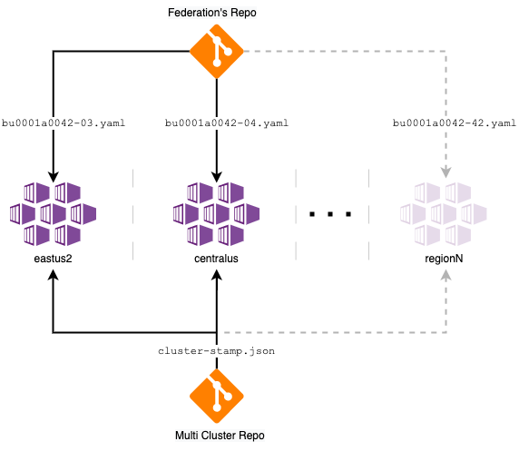

# Azure Kubernetes Service (AKS) for Multi-Region Deployment

This reference implementation will go over some design decisions from the baseline to detail them as a well as incorporate some new _recommended infrastructure options_ for a Multi Cluster architecture. In this opportunity, this implementation and document are meant to guide the multiple distinct teams introduced in the [AKS Baseline](https://github.com/mspnp/aks-secure-baseline) through the process of expanding from a single cluster to a multi-cluster solution with a fundamental driver in mind which is **High Availability**.

Throughout the reference implementation, you will see reference to _Contoso Bicycle_. They are a fictional, small, and fast-growing startup that provides online web services to its clientele on the east coast of the United States. This narrative provides grounding for some implementation details, naming conventions, etc. You should adapt as you see fit.

| 🎓 Foundational Understanding |
|:------------------------------|
| **If you haven't familiarized yourself with the general-purpose [AKS baseline cluster](https://github.com/mspnp/aks-secure-baseline) architecture, you should start there before continuing here.** The architecture rationalized and constructed that implementation is the direct foundation of this body of work. This reference implementation avoids rearticulating points that are already addressed in the AKS baseline cluster. |

The Contoso Bicycle app team that owns the `a0042` workload app is planning to deploy an AKS cluster strategically located in the `East US 2` region as this is where most of their customer base can be found. They will operate this single AKS cluster [following Microsoft's recommended baseline architecture](https://github.com/mspnp/aks-secure-baseline).

AKS Baseline clusters are meant to be available from different _Zones_ within the same region. But now they realize that if `East US 2` went fully down, zone coverage is not sufficient. Even though the SLA(s) are acceptable for their business continuity plan, they are starting to think what their options are, and how their stateless application (Application ID: a0042) could increase its availability in case of a complete regional outage. They started conversations with the business unit (BU0001) to increment the number of clusters by one. In other words, they are proposing to move to a multi-cluster infrastructure solution in which multiple instances of the same application could live.

This architectural decision will have multiple implications for the Contoso Bicycle organization. It is not just about following the baseline twice chaining the region to get a twin infrastructure. They also need to look for how they can efficiently share Azure resources as well as detect those that need to be added; how they are going to deploy more than one cluster as well as operate them; decide to which specific regions they deploy to; and many more considerations striving for high availability.

## Azure Architecture Center guidance

This project has a companion set of articles that describe challenges, design patterns, and best practices for an AKS multi cluster solution disigned to be deployed in multiple region to be highly available. You can find this article on the Azure Architecture Center at [Azure Kubernetes Service (AKS) Baseline Cluster for Multi-Region deployments](https://aka.ms/architecture/aks-baseline-multi-region). If you haven't reviewed it, we suggest you read it as it will give added context to the considerations applied in this implementation. Ultimately, this is the direct implementation of that specific architectural guidance.

| :construction: | The article series mentioned above has _not yet been published_. |
|----------------|:--------------------------|

## Architecture

**This architecture is infrastructure focused**, more so than on workload. It concentrates on two AKS clusters, including concerns like multi-region deployments, the desired state of the clusters, geo-replication, network topologies, and more.

The implementation presented here, like in the baseline, is the _minimum recommended starting (baseline) for a multiple AKS cluster solution_. This implementation integrates with Azure services that will deliver geo-replication, a centralized observability approach, a network topology that is going go with multi-regional growth, and an added benefit of additional traffic balancing as well.

Finally, this implementation uses the [ASP.NET Docker samples](https://github.com/dotnet/dotnet-docker/tree/master/samples/aspnetapp) as an example workload. This workload is purposefully uninteresting, as it is here exclusively to help you experience the baseline infrastructure.

### Core architecture components

#### Azure platform

- Azure Kubernetes Service (AKS) v1.19
- Azure Virtual Networks (hub-spoke)
- Azure Front Door
- Azure Application Gateway (WAF)
- Azure Container Registry
- Azure Monitor Log Analitycs

#### In-cluster OSS components

- [Flux GitOps Operator](https://fluxcd.io)
- [Traefik Ingress Controller](https://doc.traefik.io/traefik/v1.7/user-guide/kubernetes/)
- [Azure AD Pod Identity](https://github.com/Azure/aad-pod-identity)
- [Azure KeyVault Secret Store CSI Provider](https://github.com/Azure/secrets-store-csi-driver-provider-azure)
- [Kured](https://docs.microsoft.com/azure/aks/node-updates-kured)

| :construction: | Diagram below does _NOT accurately reflect this architecture_. **Update Pending.** |
|----------------|:--------------------------|

## Deploy the reference implementation

- [ ] Begin by ensuring you [install and meet the prerequisites](./docs/deploy/01-prerequisites.md)
- [ ] [Plan your Azure Active Directory integration](./docs/deploy/02-aad.md)
- [ ] [Build the hub-spoke network](./docs/deploy/03-networking.md)
- [ ] [Procure client-facing and AKS Ingress Controller TLS certificates](./docs/deploy/04-ca-certificates.md)
- [ ] [Deploy the shared services for your clusters](./docs/deploy/05-cluster-prerequisites.md)
- [ ] [Deploy the two AKS clusters and supporting services](./docs/deploy/06-aks-cluster.md)
- [ ] Just like the cluster, there are [workload prerequisites to address](./docs/deploy/07-workload-prerequisites.md)
- [ ] [Configure AKS Ingress Controller with Azure Key Vault integration](./docs/deploy/08-secret-managment-and-ingress-controller.md)
- [ ] [Deploy the workload](./docs/deploy/09-workload.md)
- [ ] [Perform end-to-end deployment validation](./docs/deploy/10-validation.md)
- [ ] [Cleanup all resources](./docs/deploy/11-cleanup.md)

## Cost Considerations

The main cost on the current Reference Implementation is related to (in order):

1. Azure Firewall dedicated to control outbound traffic ~35%
1. Node Pool Virtual Machines used inside the cluster ~30%
1. AppGateway which control the ingress traffic to the private vnet ~15%
1. LogAnalitycs ~10%

Azure Firewall can be a shared resource, and maybe your company already has one and you can reuse. It is not recommended, but if you want to reduce cost, you can delete the Azure Firewall and take the risk.

The Virtual Machines on the AKS Cluster are needed. The Cluster can be shared by several applications. Anyway, you can analyze the size and the amount of nodes. The Reference Implementation has the minimum recommended nodes for production environments, but in a multi-cluster environment when you have at least two clusters, based on your traffic analysis, failover strategy and autoscaling configuration, you choose different numbers.

Keep an eye on LogAnalitycs as time goes by and manage the information which is collected. The main cost is related to data ingestion into the Log Analytics workspace, you can fine tune that.

There is WAF protection enabled on Application Gateway and Azure Front Door. The WAF rules on Azure Front Door have extra cost, you can disable these rules. The consequence is that not valid traffic will arrive at Application Gateway using resources instead of being eliminated as soon as possible.

## Preview features

While this reference implementation tends to avoid _preview_ features of AKS to ensure you have the best customer support experience; there are some features you may wish to evaluate in pre-production clusters that augment your posture around security, manageability, etc. Consider trying out and providing feedback on the following. As these features come out of preview, this reference implementation may be updated to incorporate them.

* [Preview features coming from the AKS Secure Baseline](https://github.com/mspnp/aks-secure-baseline#preview-features)
* _Currently the Azure Kubernetes Service (AKS) for Multi-Region Deployment does not implement any Preview feature directly_

## Next Steps

This reference implementation intentionally does not cover all scenarios. If you are looking for other topics that are not addressed here, please visit [AKS Secure Baseline for the complete list of covered scenarios around AKS](https://github.com/mspnp/aks-secure-baseline#advanced-topics).

## Related documentation

- [Azure Kubernetes Service Documentation](https://docs.microsoft.com/azure/aks/)
- [Microsoft Azure Well-Architected Framework](https://docs.microsoft.com/azure/architecture/framework/)
- [Microservices architecture on AKS](https://docs.microsoft.com/azure/architecture/reference-architectures/containers/aks-microservices/aks-microservices)

## Contributions

Please see our [contributor guide](./CONTRIBUTING.md).

This project has adopted the [Microsoft Open Source Code of Conduct](https://opensource.microsoft.com/codeofconduct/). For more information see the [Code of Conduct FAQ](https://opensource.microsoft.com/codeofconduct/faq/) or contact <opencode@microsoft.com> with any additional questions or comments.

With :heart: from Microsoft Patterns & Practices, [Azure Architecture Center](https://aka.ms/architecture).
