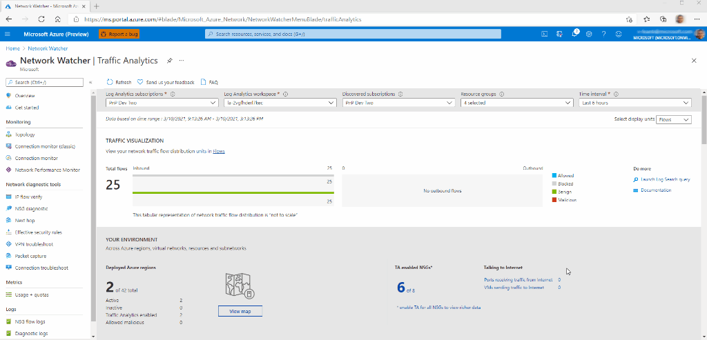

# Deploy the Hub-Spoke Network Topology

In the prior step, you've set up an Azure AD tenant to fullfil your [cluster's control plane (Kubernetes Cluster API) authorization](./02-aad.md) needs for this reference implementation deployment. Now we will start with our first Azure resource deployment, the network resources.

## Subscription and resource group topology

This reference implementation is split across several resource groups in a single subscription. This is to replicate the fact that many organizations will split certain responsibilities into specialized subscriptions (e.g. regional hubs/vwan in a _Connectivity_ subscription and workloads in landing zone subscriptions). We expect you to explore this reference implementation within a single subscription, but when you implement this cluster at your organization, you will need to take what you've learned here and apply it to your expected subscription and resource group topology (such as those [offered by the Cloud Adoption Framework](https://docs.microsoft.com/azure/cloud-adoption-framework/decision-guides/subscriptions/).) This single subscription, multiple resource group model is for simplicity of demonstration purposes only.

## Expected results

### Resource Groups

The following two resource groups will be created and populated with networking resources in the steps below.

| Name                            | Purpose                                                                                                                                                                                              |
| ------------------------------- | ---------------------------------------------------------------------------------------------------------------------------------------------------------------------------------------------------- |
| rg-enterprise-networking-hubs   | Contains all of your organization's regional hubs. A regional hubs include an egress firewall and Log Analytics for network logging.                                                                 |
| rg-enterprise-networking-spokes | Contains all of your organization's regional spokes and related networking resources. All spokes will peer with their regional hub and subnets will egress through the regional firewall in the hub. |

### Resources

- Regional Azure Firewall in each Hub Virtual Network
- One Network Spoke per Cluster
- Network Peering from the Spokes to their corresponding regional Hub
- Force Tunnel UDR for Cluster Subnets to their Hubs
- Network Security Groups for all subnets that support them

## Steps

1. Login into the Azure subscription that you'll be deploying the Azure resources into.

   > :book: The networking team logins into the Azure subscription that will contain the regional hub and spokes. At Contoso Bicycle, all of their regional hubs are in the same, centrally-managed subscription.

   ```bash
   az login -t $TENANTID_AZURERBAC
   ```

1. Create the networking hub-spoke resource groups.

   > :book: The networking team has all their regional networking hubs and spokes in the following centrally-managed Azure Resource Groups

   ```bash
   az group create -n rg-enterprise-networking-hubs -l centralus
   az group create -n rg-enterprise-networking-spokes -l centralus
   ```

   :bulb: The groups' default location does not matter, as it's not tied to the resource locations. (Please note that typically these resource groups would have already existed.)

1. Create two hubs, and two spokes that will be home to the AKS clusters and its adjacent resources and then enroll the spokes into the hubs.

   > :book: The networking team had created two generic hubs awaiting for customers to join. They receive a request from an app team in business unit (BU) 0001. This is for the creation of network spokes to house their new AKS-based application (Internally know as Application ID: A0042). The network team talks with the app team to understand their requirements and aligns those needs with Microsoft's best practices for a secure AKS cluster deployment. As part of the non-functional requirements, the app team mentions they need to run two separate infrastructure instances of the same application from two different regions, so they can increase the availability. The networking team realizes they are going to need two different spokes to fulfil the app team's requirements. They capture those specific requirements and deploy the spokes (`BU0001A0042-03` and `BU0001A0042-04`), aligning to those specs, and connecting it to the corresponding regional hub.
   >
   > The networking team has decided that `10.200.[0-9].0` will be where all regional hubs are homed on their organization's network space. The `eastus2` and `westus2` hubs (created below) will be `10.200.3.0/24` and `10.200.4.0/24` respectively.
   >
   > Note: The subnets for Azure Bastion and on-prem connectivity are deployed in this reference architecture, but the resources are not deployed. Since this reference implementation is expected to be deployed isolated from existing infrastructure; these IP addresses should not conflict with any existing networking you have, even if those IP addresses overlap. If you need to connect the reference implementation to existing networks, you will need to adjust the IP space as per your requirements as to not conflict in the reference ARM templates.

   ```bash
   # [Create the generic hubs takes about five minutes to run.]
   az deployment group create -g rg-enterprise-networking-hubs -f networking/hub-region.v1.json -n hub-regionA -p @networking/hub-region.parameters.eastus2.json
   az deployment group create -g rg-enterprise-networking-hubs -f networking/hub-region.v1.json -n hub-regionB -p @networking/hub-region.parameters.centralus.json

   # [Create the spokes takes about ten minutes to run.]
   RESOURCEID_VNET_HUB_REGIONA=$(az deployment group show -g rg-enterprise-networking-hubs -n hub-regionA --query properties.outputs.hubVnetId.value -o tsv)
   RESOURCEID_VNET_HUB_REGIONB=$(az deployment group show -g rg-enterprise-networking-hubs -n hub-regionB --query properties.outputs.hubVnetId.value -o tsv)
   az deployment group create -g rg-enterprise-networking-spokes -f networking/spoke-BU0001A0042.json -n spoke-BU0001A0042-03 -p hubVnetResourceId="${RESOURCEID_VNET_HUB_REGIONA}" @networking/spoke-BU0001A0042.parameters.eastus2.json
   az deployment group create -g rg-enterprise-networking-spokes -f networking/spoke-BU0001A0042.json -n spoke-BU0001A0042-04 -p hubVnetResourceId="${RESOURCEID_VNET_HUB_REGIONB}" @networking/spoke-BU0001A0042.parameters.centralus.json

    # [Enrolling the spokes into the hubs takes about three minutes to run.]
   RESOURCEID_SUBNET_NODEPOOLS_BU0001A0042_03=$(az deployment group show -g  rg-enterprise-networking-spokes -n spoke-BU0001A0042-03 --query properties.outputs.nodepoolSubnetResourceIds.value -o tsv)
   RESOURCEID_SUBNET_NODEPOOLS_BU0001A0042_04=$(az deployment group show -g  rg-enterprise-networking-spokes -n spoke-BU0001A0042-04 --query properties.outputs.nodepoolSubnetResourceIds.value -o tsv)
   az deployment group create -g rg-enterprise-networking-hubs -f networking/hub-region.v1.1.json -n hub-regionA -p nodepoolSubnetResourceIds="['${RESOURCEID_SUBNET_NODEPOOLS_BU0001A0042_03}']" @networking/hub-region.parameters.eastus2.json
   az deployment group create -g rg-enterprise-networking-hubs -f networking/hub-region.v1.1.json -n hub-regionB -p nodepoolSubnetResourceIds="['${RESOURCEID_SUBNET_NODEPOOLS_BU0001A0042_04}']" @networking/hub-region.parameters.centralus.json
   ```

## Preparing for a Failover

> :book: The networking team is now dealing with multiple clusters in different regions. Understanding how the traffic flows at layers 4 and 7 through their deployed networking topology is now more critical than ever. That's why the team is evaluating different tooling that could provide monitoring over their networks.  One of the Azure Monitor products at subscription level is Network Watcher that offers two really interesting features such as NSG Flow Logs and with that [Traffic Analytics](https://docs.microsoft.com/azure/network-watcher/traffic-analytics). The latter can bring some light over the table when it is about analyzing traffic like from where it is being originated, how it is flowing thought the different regions, or how much is benign vs malicious together with many more details at the security and performance level. [With no upfront cost and no termination fees](https://azure.microsoft.com/pricing/details/network-watcher/) the business unit (BU0001) would be charged for collection and processing logs per GB at 10-min or 60-min intervals.



> :bulb: The [AKS Baseline](https://github.com/mspnp/aks-secure-baseline) has already covered the how(s) and why(s) of the current [network topology segmentation](https://github.com/mspnp/aks-secure-baseline/blob/main/networking/topology.md). But something that is worth to remember while preparing for a high availability architecture is that the network needs to be right sized to absorb a sudden increase in traffic that might request twice the number of IPs when scheduling more _Pods_ to failover a region.

### Next step

:arrow_forward: [Generate your client-facing TLS certificate](./04-ca-certificates.md)
