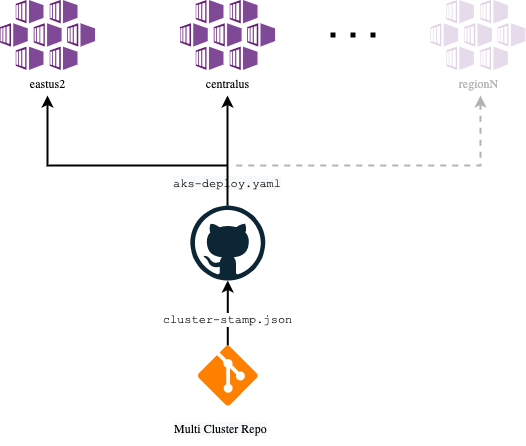

# Deploy the AKS Clusters in two different regions

Now that the [cluster prequisites and shared Azure service instances are provisioned](./05-cluster-prerequisites.md), the next step in the [AKS baseline multi cluster reference implementation](/README.md) is deploying the AKS clusters and its adjacent Azure resources.

## Expected results

Following the steps below will result in the provisioning of the AKS multi cluster solution.

| Object                        | Purpose                                                                                                                                                                                                                                                                                             |
| ----------------------------- | ---------------------------------------------------------------------------------------------------------------------------------------- |
| GitHub Workflow               | A GitHub Workflow that deploys the multi cluster infrastructure in two different regions                                                 |
| Two Azure Application Gateway | One Azure Application Gateway in East US 2 and another one from its paired region Central US                                             |
| Two configured AKS Clusters   | Two AKS Clusters in the same detailed regions and configured with their initial desired state. It is Flux, Azure Pod Identity, and more. |

## Steps

> :book: The selected locations are `East US 2` and `Central US` which are Azure paired regions. All in all, the team resolution is to have a single CI/CD pipeline that is aware of the multiple clusters being deployed, and could take measures in case of errors while deploying for a particular region. This pipeline uses a common stamp for the cluster creation with different parameter files per region, and it will be also enrolling the AKS Clusters in GitOps to help with the initial desired state. From there, Flux will take care of rest of the AKS cluster setup process.  In this case, the app team decided to use GitHub Actions. They are going to create a workflow grouping all AKS clusters in different regions that are serving the same application. They know that every change in their cluster stamp or workflow will impact most probably all clusters. But there are some special cases they want to contemplate like adding a new cluster to their fleet. For those scenarios, they are tagging the pipeline execution to exclude and remain them untouched from that particular execution.



> :bulb: Multi Cluster and Federation's repos could be a monorepo or multiple repos as displayed from the digram above. In this reference implementation, the workload manifests, and ARM templates are shipped together from a single repo.


> :bulb: Another interesting use case that this architecture could help with is when AKS introduces _Preview Features_ in the same or different regions. They could in some case be a breaking in an upcoming major releases like happened with `containerd` as the new default runtime. In those situtations, you might want to do some A/B testing without fully disrupting your live and stable AKS cluster.

1.  Obtain shared services resource details

    ```bash
    LOGANALYTICSWORKSPACEID=$(az deployment group show -g rg-bu0001a0042-shared -n shared-svcs-stamp --query properties.outputs.logAnalyticsWorkspaceId.value -o tsv)
    CONTAINERREGISTRYID=$(az deployment group show -g rg-bu0001a0042-shared -n shared-svcs-stamp --query properties.outputs.containerRegistryId.value -o tsv)
    ACRPRIVATEDNSZONESID=$(az deployment group show -g rg-bu0001a0042-shared -n shared-svcs-stamp --query properties.outputs.acrPrivateDnsZonesId.value -o tsv)
    ```

1.  Get the corresponding AKS cluster spoke VNet resource IDs for the app team working on the application A0042.

    > :book: The app team will be deploying to a spoke VNet, that was already provisioned by the network team.

    ```bash
    RESOURCEID_VNET_BU0001A0042_03=$(az deployment group show -g rg-enterprise-networking-spokes -n spoke-BU0001A0042-03 --query properties.outputs.clusterVnetResourceId.value -o tsv)
    RESOURCEID_VNET_BU0001A0042_04=$(az deployment group show -g rg-enterprise-networking-spokes -n spoke-BU0001A0042-04 --query properties.outputs.clusterVnetResourceId.value -o tsv)
    ```

    1.  Create the Azure Credentials for the GitHub CD workflow.

        ```bash
        # Create an Azure Service Principal
        az ad sp create-for-rbac --name "github-workflow-aks-cluster" --sdk-auth --skip-assignment > sp.json
        APP_ID=$(grep -oP '(?<="clientId": ").*?[^\\](?=",)' sp.json)

        # Wait for propagation
        until az ad sp show --id ${APP_ID} &> /dev/null ; do echo "Waiting for Azure AD propagation" && sleep 5; done

        # Assign built-in Contributor RBAC role for creating resource groups and performing deployments at subscription level
        az role assignment create --assignee $APP_ID --role 'Contributor'

        # Assign built-in User Access Administrator RBAC role since granting RBAC access to other resources during the cluster creation will be required at subscription level (e.g. AKS-managed Internal Load Balancer, ACR, Managed Identities, etc.)
        az role assignment create --assignee $APP_ID --role 'User Access Administrator'
        ```

    1.  Create `AZURE_CREDENTIALS` secret in your GitHub repository.

        > :bulb: Use the content from the `sp.json` file.

        ```bash
        gh secret set AZURE_CREDENTIALS  -b"$(cat sp.json)" -repo=":owner/:repo"
        ```

    1.  Create `APP_GATEWAY_LISTENER_REGION1_CERTIFICATE_BASE64` and `APP_GATEWAY_LISTENER_REGION2_CERTIFICATE_BASE64` secret in your GitHub repository.

        ```bash
        gh secret set APP_GATEWAY_LISTENER_REGION1_CERTIFICATE_BASE64  -b"${APP_GATEWAY_LISTENER_REGION1_CERTIFICATE_BASE64}" -repo=":owner/:repo"
        gh secret set APP_GATEWAY_LISTENER_REGION2_CERTIFICATE_BASE64  -b"${APP_GATEWAY_LISTENER_REGION2_CERTIFICATE_BASE64}" -repo=":owner/:repo"
        ```

    1.  Create `AKS_INGRESS_CONTROLLER_CERTIFICATE_BASE64` secret in your GitHub repository.

        ```bash
        gh secret set AKS_INGRESS_CONTROLLER_CERTIFICATE_BASE64  -b"${AKS_INGRESS_CONTROLLER_CERTIFICATE_BASE64}" -repo=":owner/:repo"
        ```

    1.  Copy the GitHub workflow file into the expected directory

        ```bash
        mkdir -p .github/workflows
        cat github-workflow/aks-deploy.yaml > .github/workflows/aks-deploy.yaml
        ```

    1.  Generate cluster parameter file per region

        ```bash
        # Region 1
        sed -i "s#<cluster-spoke-vnet-resource-id>#${RESOURCEID_VNET_BU0001A0042_03}#g" ./azuredeploy.parameters.eastus2.json && \
        sed -i "s#<tenant-id-with-user-admin-permissions>#${TENANTID_K8SRBAC}#g" ./azuredeploy.parameters.eastus2.json && \
        sed -i "s#<azure-ad-aks-admin-group-object-id>#${AADOBJECTID_GROUP_CLUSTERADMIN_BU0001A004203}#g" ./azuredeploy.parameters.eastus2.json && \
        sed -i "s#<log-analytics-workspace-id>#${LOGANALYTICSWORKSPACEID}#g" ./azuredeploy.parameters.eastus2.json && \
        sed -i "s#<container-registry-id>#${CONTAINERREGISTRYID}#g" ./azuredeploy.parameters.eastus2.json && \
        sed -i "s#<acrPrivateDns-zones-id>#${ACRPRIVATEDNSZONESID}#g" ./azuredeploy.parameters.eastus2.json

        # Region 2
        sed -i "s#<cluster-spoke-vnet-resource-id>#${RESOURCEID_VNET_BU0001A0042_04}#g" ./azuredeploy.parameters.centralus.json && \
        sed -i "s#<tenant-id-with-user-admin-permissions>#${TENANTID_K8SRBAC}#g" ./azuredeploy.parameters.centralus.json && \
        sed -i "s#<azure-ad-aks-admin-group-object-id>#${AADOBJECTID_GROUP_CLUSTERADMIN_BU0001A004204}#g" ./azuredeploy.parameters.centralus.json && \
        sed -i "s#<log-analytics-workspace-id>#${LOGANALYTICSWORKSPACEID}#g" ./azuredeploy.parameters.centralus.json && \
        sed -i "s#<container-registry-id>#${CONTAINERREGISTRYID}#g" ./azuredeploy.parameters.centralus.json && \
        sed -i "s#<acrPrivateDns-zones-id>#${ACRPRIVATEDNSZONESID}#g" ./azuredeploy.parameters.centralus.json
        ```

    1.  Customize Flux to watch your own repo.

        > :book: GitOps allows a team to author Kubernetes manifest files, persist them in their git repo, and have them automatically applied to their clusters as changes occur. This reference implementation is for a multi cluster infrastructure, so Flux is going to use Kustomization to deploy regions differenly by using a set of base manifest and patching them when needed.

        ```bash
        sed -i -e 's/<user-name>/${GITHUB_USER_NAME}/' cluster-manifests/base/cluster-baseline-settings/flux-system/flux.yaml
        ```

        > :bulb: You want to modify your GitOps manifest file to point to your forked repo. Later on you can push changes to your repo, and they will be reflected in the state of your cluster.

    1.  The workflow is triggered when a push on the `main` branch is detected. Therefore, push the changes to your forked repo.

        > :book: The app team monitors the workflow execution as this is impacting a critical piece of infrastructure. This flow works for both new or existing AKS clusters. The workflow deploys the multiple clusters in different regions, and configures the desired state for them.

        ```bash
        git add -u && git add .github/workflows/aks-deploy.yaml && git commit -m "setup GitHub CD workflow" && git push origin main
        ```

        > :bulb: You might want to convert this GitHub workflow into a template since your organization or team might need to handle multiple AKS clusters. For more information, please take a look at [Sharing Workflow Templates within your organization](https://docs.github.com/actions/configuring-and-managing-workflows/sharing-workflow-templates-within-your-organization).

    1.  You can continue only after the GitHub Workflow completes successfully

        ```bash
        until export GH_WF_STATUS=$(gh api /repos/:owner/:repo/actions/runs/$(gh api /repos/:owner/:repo/actions/runs -q ".workflow_runs[0].id") -q ".status" 2> /dev/null) && [[ $GH_WF_STATUS == "completed" ]]; do echo "Monitoring GitHub workflow execution: ${GH_WF_STATUS}" && sleep 20; done
        ```

    1.  Get the cluster names for regions 1 and 2.

        ```bash
        AKS_CLUSTER_NAME_BU0001A0042_03=$(az deployment group show -g rg-bu0001a0042-03 -n cluster-stamp --query properties.outputs.aksClusterName.value -o tsv)
        AKS_CLUSTER_NAME_BU0001A0042_04=$(az deployment group show -g rg-bu0001a0042-04 -n cluster-stamp --query properties.outputs.aksClusterName.value -o tsv)
        ```

    1.  Get AKS `kubectl` credentials.

        > In the [Azure Active Directory Integration](03-aad.md) step, we placed our cluster under AAD group-backed RBAC. This is the first time we are seeing this used. `az aks get-credentials` allows you to use `kubectl` commands against your cluster. Without the AAD integration, you'd have to use `--admin` here, which isn't what we want to happen. In a following step, you'll log in with a user that has been added to the Azure AD security group used to back the Kubernetes RBAC admin role. Executing the first `kubectl` command below will invoke the AAD login process to auth the _user of your choice_, which will then be checked against Kubernetes RBAC to perform the action. The user you choose to log in with _must be a member of the AAD group bound_ to the `cluster-admin` ClusterRole. For simplicity you could either use the "break-glass" admin user created in [Azure Active Directory Integration](03-aad.md) (`bu0001a0042-admin`) or any user you assigned to the `cluster-admin` group assignment in your [`cluster-rbac.yaml`](cluster-manifests/cluster-rbac.yaml) file. If you skipped those steps you can use `--admin` to proceed, but proper AAD group-based RBAC access is a critical security function that you should invest time in setting up.

        ```bash
        az aks get-credentials -g rg-bu0001a0042-03 -n $AKS_CLUSTER_NAME_BU0001A0042_03
        az aks get-credentials -g rg-bu0001a0042-04 -n $AKS_CLUSTER_NAME_BU0001A0042_04
        ```

        :warning: At this point two important steps are happening:

        - The `az aks get-credentials` command will be fetch a `kubeconfig` containing references to the AKS cluster you have created earlier.
        - To _actually_ use the cluster you will need to authenticate. For that, run any `kubectl` commands which at this stage will prompt you to authenticate against Azure Active Directory. For example, run the following command:

        ```bash
        kubectl get nodes --context $AKS_CLUSTER_NAME_BU0001A0042_03
        kubectl get nodes --context $AKS_CLUSTER_NAME_BU0001A0042_04
        ```

        Once the authentication happens successfully, some new items will be added to your `kubeconfig` file such as an `access-token` with an expiration period. For more information on how this process works in Kubernetes please refer to [the related documentation](https://kubernetes.io/docs/reference/access-authn-authz/authentication/#openid-connect-tokens).

    1.  Ensure Flux in region 1 and 2 has created the workload namespaces.

        :bulb: Please notice that both namespaces are Kustomization overlays, and as such they were customized to be annotated with the region number.

        ```bash
        # press Ctrl-C once you receive a successful response
        kubectl get ns a0042 -o yaml -w --context $AKS_CLUSTER_NAME_BU0001A0042_03

        # press Ctrl-C once you receive a successful response
        kubectl get ns a0042 -o yaml -w --context $AKS_CLUSTER_NAME_BU0001A0042_04
        ```

### Next step

:arrow_forward: [Prepare for the workload by installing its prerequisites](./07-workload-prerequisites.md)
