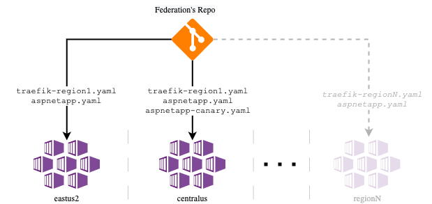
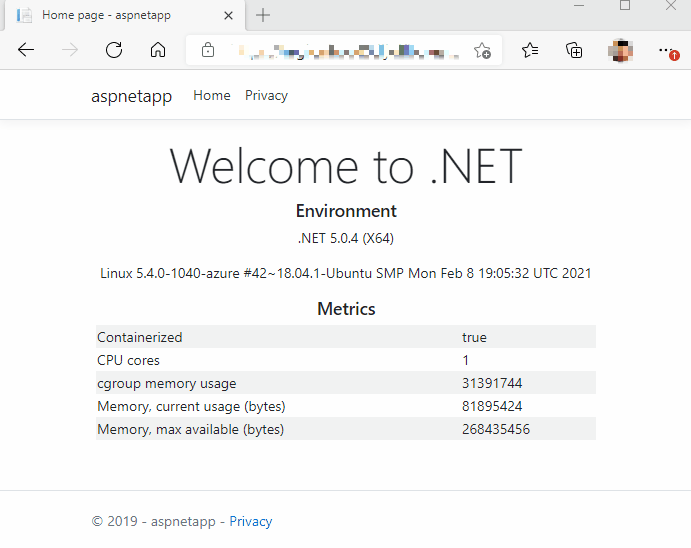

# Deploy the Workload (ASP.NET Core Docker web app)

The cluster now has [Traefik configured with a TLS certificate](./08-secret-managment-and-ingress-controller.md). The last step in the process is to deploy the workload, which will demonstrate the system's functions.

## Steps

> :book: The Contoso app team is about to conclude this journey, but they need an app to test their new infrastructure. For this task they've picked out the venerable [ASP.NET Core Docker sample web app](https://github.com/dotnet/dotnet-docker/tree/master/samples/aspnetapp). The business unit (BU0001) has approved the creation of a second cluster that could help balance the traffic, but mainly to serve as a hot backup. They are a bit worried about the required engineering effort though. The same application (Application Id: a0042) is about to span into multiple clusters, across multiple regions, so there is a desire to find a good mechanism for common configuration management. With that in mind, the app team is looking at what _federation_ approaches they could follow to run different instances of the exact same app in different clusters.  They know that at this point things must be kept simple, in fact they could run these two application instances (Applications Ids: `a0042-03` and `a0042-04`) from the two regional clusters with just a bunch of useful scripts. But they want to be sure that the selected approach is not going to be adding impediments that could prevent from scaling out their fleet of clusters down to road if there was a requirement to scale to more clusters in more regions. Depending on how federation is implemented it could open a door in which a single command execution has an instant ripple effect into all your clusters. While running clusters separately like silos could keep you safe from the same, but the cost could be really high to scale the number of clusters in the future. They know that there is [specialized tooling](https://github.com/kubernetes-sigs/kubefed) out there that helps manage a centralized control plane to push the workload(s) behavior top to bottom reacting to special events like a regional outage but they want to proceed with caution in this area for now.  Given that this reference implementation provides a middle ground solution in which an organization could build the basis for the future without this being a weight on their shoulders for just two clusters. Therefore, the recommendation is to manage the workload manifests separately per instance from a central _federation_ git repository in combination with a CI/CD pipeline. The latter is not implemented as part of this reference implementation.



> :bulb: Federation's repos could be a monorepo or multiple repos. In this reference implementation, the workload manifests are shipped together from a single repo.

1. Deploy the ASP.NET Core Docker sample web app in the AKS Cluster deployed to Region 1

   > The workload definition demonstrates the inclusion of a Pod Disruption Budget rule, ingress configuration, and pod (anti-)affinity rules for your reference.

   ```bash
   kubectl apply -f ./workload/aspnetapp.yaml --context $AKS_CLUSTER_NAME_BU0001A0042_03
   ```

1. Deploy the same workload as another instance in the second AKS cluster deployed to Region 2. Additionally, you will be enable some canary testing from the second cluster.

   > :book: The app team is now more confident than ever with its second regional AKS cluster. The team follows an active/active High Availability strategy, and it is known that the major stream of clients comes from East US 2. Therefore, they realize they have some idle resources most of the time from Central US. This makes them to consider starting some canary testing in that specific region as this will be introducing a very low risk for normal operations. Using a weighted load balanced strategy, clients will be attended most of the time by their well known and stable ASP.NET Core 3.1 workload app, while few times by the new workload version on top of ASP.NET 5. From this experimentation, the app team wants to evaluate the memory utilization of their workload using the new ASP.NET version 5. This will allow them to plan ahead before a full migration.

   > :warning: Please note that this canary testing story is not recommended for organizations that are operating critical production systems as peak utilization. But this is a good example of what are the options being enabled when adding more availability to your application, and having some idle resources to be employed with care.

   ```bash
   kubectl apply -f ./workload/aspnetapp.yaml --context $AKS_CLUSTER_NAME_BU0001A0042_04
   kubectl apply -f ./workload/aspnetapp-canary.yaml --context $AKS_CLUSTER_NAME_BU0001A0042_03
   ```

1. Wait until both regions are ready to process requests

   ```bash
   kubectl wait -n a0042 --for=condition=ready pod --selector=app.kubernetes.io/name=aspnetapp --timeout=90s --context $AKS_CLUSTER_NAME_BU0001A0042_03
   kubectl wait -n a0042 --for=condition=ready pod --selector=app.kubernetes.io/name=aspnetapp-canary --timeout=90s --context $AKS_CLUSTER_NAME_BU0001A0042_03
   kubectl wait -n a0042 --for=condition=ready pod --selector=app.kubernetes.io/name=aspnetapp --timeout=90s --context $AKS_CLUSTER_NAME_BU0001A0042_04
   kubectl wait -n a0042 --for=condition=ready pod --selector=app.kubernetes.io/name=aspnetapp-canary --timeout=90s --context $AKS_CLUSTER_NAME_BU0001A0042_04
   ```

1. Check the status of your Ingress resources as a way to confirm the AKS-managed Internal Load Balancer is functioning

   > In this moment your Ingress Controller (Traefik) is reading your ingress resource object configuration, updating its status, and creating a router to fulfill the new exposed workloads route. Please take a look at this and notice that the address is set with the Internal Load Balancer IP from the configured subnet.

   ```bash
   kubectl get ingress aspnetapp-ingress -n a0042 --context $AKS_CLUSTER_NAME_BU0001A0042_03
   kubectl get ingress aspnetapp-ingress -n a0042 --context $AKS_CLUSTER_NAME_BU0001A0042_04
   ```

   > At this point, the route to the workload is established, SSL offloading configured, and a network policy is in place to only allow Traefik to connect to your workload. Therefore, you should expect a `403` HTTP response if you attempt to connect to it directly.

> :book: The app team is happy to confirm to the BU0001 that their workload is now consuming less memory thanks to this update.



### Next step

:arrow_forward: [End to End Validation](./10-validation.md)
